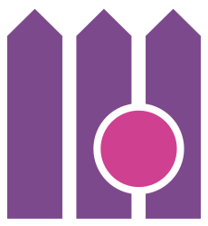

<h1 align="center">
   
    
   
  dotnet-fences
   
</h1>

 
Simple code boundary management for C# projects.

   

  

  <h3>
    <a href="#quickstart">
      Quickstart
    </a>
    |
    <a href="#features">
      Features
    </a>
    |
    <a href="#project-info">
      Project info
    </a>
    |
    <a href="docs/CHANGELOG.md">
      Changelog
    </a>

    Built with 🤘🏻by <a href="https://lenar.dev">Bartosz Lenar</a>

     

## Quickstart

*(coming soon)*

## Features

*(coming soon)*

## Project info

*(coming soon)*

### Versioning

[Semantic versioning](https://semver.org/) is being used very strictly. The major version is updated only when there is a breaking change, no matter how small it might be (e.g., adding extra method to the public interface). On the other hand, a huge pack of new features will bump the minor version only.

Before every major version update, at least one preview version is published.

### Licencing

Validot uses the [MIT license](../LICENSE). Long story short; you are more than welcome to use it anywhere you like, completely free of charge and without oppressive obligations.